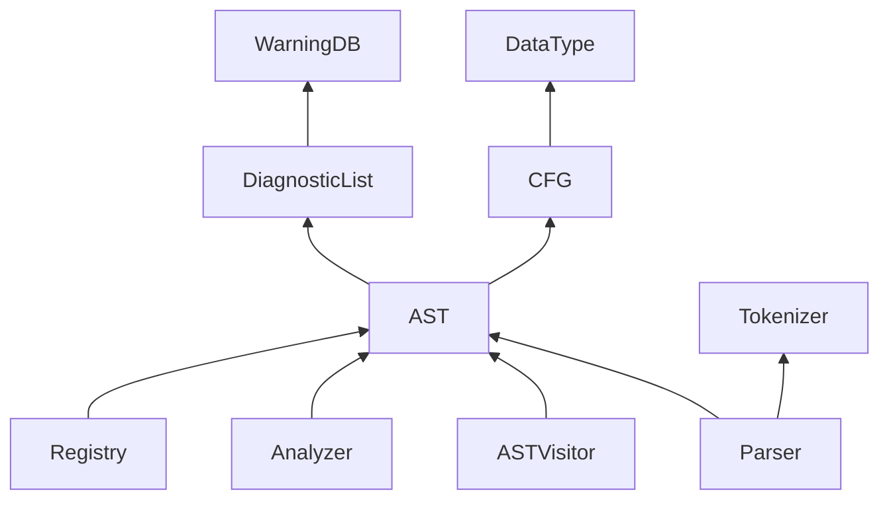

# GDScript Compiler

## Class diagram

Edges on the graph represent `#include` dependencies (excluding transitive ones).

```mermaid
graph BT
	DiagnosticList --> WarningDB
	CFG --> DataType
	AST --> DiagnosticList
	AST --> CFG
	Parser --> Tokenizer
	Parser --> AST
	ASTVisitor --> AST
	Analyzer --> AST
	Registry --> AST
```
